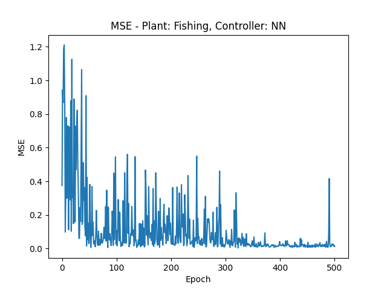

# Controlling dynamic systems with JAX

This project implements a controller system for regulating physical or economic systems to a desired level when noise and system dynamics are causing disturbances. The implementation includes both a traditional PID controller and a neural network-based controller. It uses the JAX library, which applies just-in-time compilation with XLA (accelerated linear algebra) to quickly compute gradients.

## Explanation of PID Controllers

A PID (Proportional-Integral-Derivative) controller continuously calculates an error value as the difference between the output value of a system ('plant') and a desired target value and applies a reuglating control signal to plant-variables based on the proportional, integral, and derivative terms.

The controller output is given by:

```
u(t) = Kp * e(t) + Ki * ∫e(t)dt + Kd * de(t)/dt
```

Where:

- `Kp`, `Ki`, and `Kd` are the coefficients for the proportional, integral, and derivative terms
- `e(t)` is the difference between the target and the current plant value

## How to use

Run the main script to start the simulation:

```bash
python main.py
```

The system will run for the given number of epochs and display the evolution of the parameters and the loss function. System parameters can be adjusted in the `config.py` file:

- Plant selection
- Controller selection (PID or Neural Network)
- Learning parameters (learning rate etc.)
- Initial PID parameters
- Neural network architecture
- Plant-specific parameters

This code implements two types of controllers:

1. **Traditional PID Controller**: Uses traditional PID parameters (Kp, Ki, Kd)
2. **Neural Network Controller**: Uses a trained neural network to determine control signals based on error inputs

The system can in principle regulate any model, but has only been tested on simple systems governed by difference or differential equations. To make a new model:

1. create a "simulation function" which accepts application specific tuple-parameters "vars" and "constants" and control signal and noise elements "U" and "D", along with an "update" flag telling if we want to update the system variables or merely retrieve the setpoint. If 'update' is true it should return the variables-tuple (note: in many applications the only 'variable' will just be the value we want to regulate) after a timestep, when the models dynamics and the control signal have been applied. If 'update' is false, it should merely return the current value of the system. For example for the model of the logistic growth of a fish population:

```python
def fishing_sim(vars, constants, U=0, D=0, update=False):
    F = vars
    r, N, = constants
    if update:
        F_delta = r * F * (1 - F/N) + U + D # difference equation + signal + noise
        F = jnp.maximum(0.001, F + F_delta) # update the variable, ensuring a positive value
        vars = F
        return vars
    else:
        val = F
        return val # merely return the current value

python
```

2. Create a new "plant" subclass which accepts configuration parameters and specifies the variables, constants and simulation function to be used. E.g. for the fishing model:

```python
class Fishing(Plant):
    def __init__(self, F_init, r, N): # initial population, growth rate, and carrying capacity
        super().__init__(F_init, (r, N), fishing_sim)
python
```

Three example systems are provided:

- **Bathtub**: A physical system simulating water level regulation. We're controlling water inflow/outflow and trying to maintain a target water level. Disturbing factors include noise in the inflow/outflow and a leak in the water tank.
- **Cournot**: An economic model simulating cournot competition between two firms, meaning they compete on quantity and prices are determined by the market. We're controlling the output of one firm while noise is regulating the output of the other firm, and the goal is to mainintain a target profit for the controlled firm.
- **Fishing**: A biological system simulating a logistically growing population, for example of fish. We're controlling by 'fishing' or 'stocking' so that the level remains constant in spite of noise and the natural growth of the population.

## Modules

The code is organized into several modules, which because of the brevity of the code, are all in the 'main.py' file.

### Module 1: Main Loop

- Contains `run_system_and_plot_results()` function which:
  - Initializes the plant (Bathtub, Cournot, or Fishing)
  - Initializes the controller (PID or Neural Network)
  - Calls the `run_system()` function of the control system, which optimizes the controller parameters
  - Visualizes results with plots showing MSE, controller parameters, and plant values

### Module 2: Plants

- Defines the `Plant` base class and the subclasses for each specific plant (Bathtub, Cournot, Fishing)
- Each plant has its own simulation function (`bathtub_sim`, `cournot_sim`, `fishing_sim`) that:
  - Updates plant variables based on control signals and noise
  - Returns current plant values

### Module 3: Control System

- Implements the `ConSys` class which:
  - Manages the interaction between plant and controller
  - Passes the control signal from the `Controller` class to the plant and retrieves the updated plant value
  - Calculates errors between plant values and target and gives them to the controller
  - Computes the gradients for optimization and gives them to the controller

### Module 4: Controllers

- Base `Controller` class which:
  - Calculates control signals based on the errors and gives them to the ConSys class
  - Updates parameters based on the gradients received from the ConSys class
- Two controller subclasses:
  - `PID_Controller`: Traditional PID controller with Kp, Ki, Kd parameters
  - `NN_Controller`: Neural network-based controller
- Each controller has its own `model` function that computes the control signal based on the error, either using the PID formula or a neural network

## Results

Results of running the system for all implemented systems and controllers are shown in `results.pdf`. For example, this is the evolution of the MSE loss for the logistic growth system where a neural network has been used for computing the control signal:


